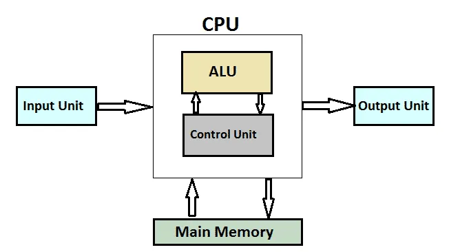

# Understanding How Computers Work

## Block Diagram of a Computer

### Components:
1. **CPU (Central Processing Unit)**:
   - Divided into:
     - **ALU (Arithmetic and Logical Unit)**: Performs arithmetic (addition, subtraction, multiplication, division) and logical operations (comparison, AND, OR, NOT).
     - **CU (Control Unit)**: Manages and utilizes other components such as memory and input/output devices.

2. **Main Memory**:
   - Temporary storage where programs are brought for execution.
   - Acts as a working memory or workspace.

3. **Hard Disk Drive**:
   - Permanent storage for files, categorized as:
     - **Program Files**: e.g., `notepad.exe`.
     - **Data Files**: e.g., `my.txt`, music files, video files.

4. **Input Devices**:
   - Examples: Keyboard, mouse, stylus, etc.

5. **Output Devices**:
   - Examples: Monitor, printer, speakers, etc.

---

## How Components Work Together

1. **CPU Operations**:
   - The CPU is the heart of the computer, executing instructions line by line.
   - Example processors: i3, i5, i7.
   - **ALU**: Handles arithmetic and logical operations.
   - **CU**: Controls and utilizes resources like memory and I/O devices.

2. **Memory Management**:
   - Programs and files are stored permanently on the hard disk.
   - Programs must be loaded into the main memory for execution.
   - CPU fetches instructions from the main memory and executes them.

3. **Input and Output**:
   - Input devices provide data (e.g., from a keyboard or file).
   - Output devices display or print results.
   - Data flows through buffers:
     - **Input Buffer**: Temporarily holds input data.
     - **Output Buffer**: Temporarily holds output data before it is displayed.

---

## File Types in the Hard Disk

1. **Program Files**:
   - Contain executable code (e.g., `notepad.exe`).
   - Enable applications to run.

2. **Data Files**:
   - Contain user-generated or application-generated data (e.g., `my.txt`, audio/video files).

---

## Input and Output Buffers

- Input and output devices have dedicated memory regions called buffers.
- Example:
  - Keyboard input goes to the input buffer.
  - Monitor output is written to the output buffer.
- Programs interact with these buffers to read/write data.

---

## Key Takeaways

1. Programs stored on the hard disk must be loaded into main memory for execution.
2. CPU executes instructions sequentially and interacts with I/O devices via buffers.
3. Input and output operations are managed through respective buffers for efficient communication.

---